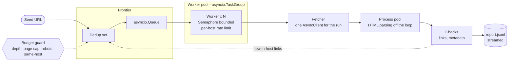
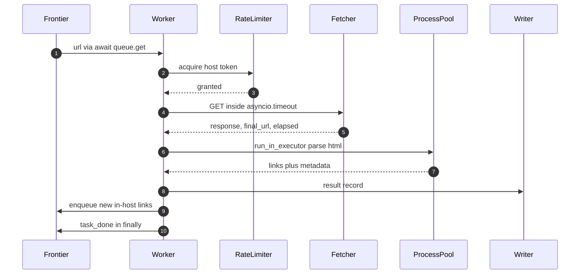

<div align="center">

# site-auditor

### A concurrent site crawler and link-health auditor

**`asyncio` for network I/O · a process pool for HTML parsing · every performance claim backed by a benchmark in this repository**

<br>


<!-- Swap in once CI is green (Phase 00):
[](https://github.com/subham-hq/site-auditor/actions/workflows/ci.yml)
-->

**[Overview](#overview) · [Status](#status) · [Architecture](#architecture) · [Usage](#usage) · [Performance](#performance) · [Decisions](#design-decisions) · [Build log](#build-log)**

</div>

---

> [!WARNING]
> **Not usable yet — this is Phase 00 of 08.**
> The repository is public from the first commit so the design and the build sequence are
> visible, not because there is anything to install. Nothing in this document describes
> working software except where the [Status](#status) table says so.
>
> No performance figure will appear here that `benchmarks/` cannot reproduce.

<br>

<details>
<summary><b>Table of contents</b></summary>

- [Overview](#overview)
  - [What it does](#what-it-does)
  - [Non-goals](#non-goals)
- [Status](#status)
  - [Build phases](#build-phases)
- [Architecture](#architecture)
  - [Crawl pipeline](#crawl-pipeline)
  - [Lifecycle of a single page](#lifecycle-of-a-single-page)
  - [The dependency rule](#the-dependency-rule)
  - [Module layout](#module-layout)
- [Usage](#usage)
- [Performance](#performance)
- [Engineering standards](#engineering-standards)
- [Design decisions](#design-decisions)
- [Why this exists](#why-this-exists)
- [Build log](#build-log)
- [Limitations](#limitations)
- [License](#license)

</details>

<br>

## Overview

Point it at a host. It crawls breadth-first within that host, checks the health of every
link it finds, extracts and validates page metadata, and writes a report a CI pipeline can
act on.

The interesting part is not the crawling. It is doing it **concurrently without lying about
it** — bounded in-flight requests, correct cancellation, streamed output that keeps memory
flat, and a benchmark honest enough to report the parts that lost.

### What it does

| | Capability |
|:---:|---|
| 🕸️ | Concurrent breadth-first crawl of a single host, bounded by depth and page budget |
| 🔗 | Per-link status code, final URL after redirects, and response time |
| 🚨 | Detects broken links (4xx/5xx), redirect chains, and mixed-content links |
| 🏷️ | Page metadata checks — `<title>`, meta description, canonical, `h1` count |
| 🤖 | `robots.txt` compliance and per-host rate limiting |
| 🔁 | Retries transient failures with backoff and jitter; never retries a 4xx |
| 📄 | Streams JSONL to disk — memory stays flat across thousands of pages |
| ⏹️ | Ctrl-C exits cleanly, flushes partial results, returns `130` |
| ✅ | Exit code `1` when links are broken, so it can gate a build |

### Non-goals

<details>
<summary><b>Deliberately out of scope — these are decisions, not a backlog</b></summary>

<br>

| Not building | Why |
|---|---|
| Web dashboard or HTTP API | Dilutes the focus. This is a CLI tool that fits in a pipeline. |
| Distributed workers (Celery, Redis) | Unjustifiable complexity at this scale, and indefensible in review. |
| Database persistence | JSONL is the correct output for a stateless auditor. |
| Headless-browser JS rendering | Changes what the tool fundamentally is. |
| Authenticated / login-walled crawling | Out of scope for a public link auditor. |
| SEO scoring or sitemap generation | A different product wearing the same hat. |
| Entry-point plugin system | The `Check` protocol already covers extension. |
| Output formats beyond JSONL and console | Two formats, both done well. |

> [!NOTE]
> This table is the scope contract. It was written before the first commit and is not
> expected to grow — if something moves from here into the feature list, that is a decision
> worth recording in the [decision log](#design-decisions), not a quiet edit.

</details>

<br>

---

## Status

```
Phase ▰▱▱▱▱▱▱▱ 1 / 8 complete
```

**What works today:** nothing. The repository is scaffolding and design.

| # | Phase | Delivers | Status |
|:---:|---|---|:---:|
| 00 | Scaffold | packaging, `mypy --strict`, `ruff`, green CI | ✅ |
| 01 | Core model | models, protocols, URL normalisation, frontier |  |
| 02 | Network layer | async fetcher, retry, rate limit, robots | ⬜ |
| 03 | Crawl engine | queue, worker pool, cancellation | ⬜ |
| 04 | Parsing | HTML off the event loop, pluggable checks | ⬜ |
| 05 | Interface | streaming JSONL, console summary, CLI | ⬜ |
| 06 | Benchmark | four execution models over a fixed corpus | ⬜ |
| 07 | Harden | test coverage, docs, `v1.0.0` | ⬜ |

### Build phases

<details>
<summary><b>Phase 00 — Scaffold</b></summary>

<br>

A repository that does nothing, perfectly.

- [ ] `uv init`, `src/` layout, console-script entry point
- [ ] Toolchain pinned: `ruff`, `mypy`, `pytest`, `pytest-asyncio`, `httpx`
- [ ] `mypy --strict` configured; `ruff` rules chosen deliberately, not copied
- [ ] `errors.py` — `AuditError` hierarchy, written before anything can raise
- [ ] GitHub Actions running lint, type-check and tests on push

**Done when** `uv run siteaudit --version` prints a version and CI is green on an empty
test suite.

</details>

<details>
<summary><b>Phase 01 — Core model</b></summary>

<br>

Everything pure and synchronous, tested to the floor. No network.

- [ ] `models.py` — frozen dataclasses with `slots=True`
- [ ] `protocols.py` — `Fetcher` and `Check`
- [ ] `urls.py` — normalisation, same-host predicate, relative resolution
- [ ] `frontier.py` — dedup set, depth tracking, budget guard
- [ ] Adversarial URL tests: fragments, uppercase hosts, protocol-relative, `mailto:`,
      `javascript:`, default ports, percent-encoding

**Done when** `test_urls.py` covers 15+ hostile cases and the frontier refuses duplicates,
off-host URLs and over-budget URLs.

</details>

<details>
<summary><b>Phase 02 — Network layer</b></summary>

<br>

The network, behind the Protocol.

- [ ] `fetcher.py` — one `AsyncClient`, explicit `httpx.Limits`, async context manager
- [ ] `decorators.py` — `@retry` with exponential backoff and jitter; policy as data
- [ ] `ratelimit.py` — per-host token bucket
- [ ] `robots.py` — fetched once, parsed, honoured

**Done when** `FakeFetcher` satisfies the `Fetcher` protocol without inheriting from it, and
the retry test uses a fetcher that fails twice then succeeds — no mocking library anywhere.

</details>

<details>
<summary><b>Phase 03 — Crawl engine</b></summary>

<br>

The heart of the project. Budget the most time here and expect one rewrite.

- [ ] `asyncio.Queue` frontier, N workers inside a `TaskGroup`
- [ ] `Semaphore` in-flight bound; `asyncio.timeout()` per request
- [ ] Correct termination: `await queue.join()` then cancel; `task_done()` in `finally`
- [ ] Graceful cancellation on `KeyboardInterrupt`, partial results flushed
- [ ] Developed under `debug=True`, every slow-callback warning treated as a defect

**Done when** a 50-page crawl runs entirely off `FakeFetcher`, Ctrl-C exits clean with
partial output and code `130`, and a cancellation test passes in CI.

</details>

<details>
<summary><b>Phase 04 — Parsing</b></summary>

<br>

The CPU half, where the GIL stops being theory.

- [ ] `parsing.py` — pure, picklable, dependency-free functions
- [ ] `ProcessPoolExecutor` via `run_in_executor`, size configurable
- [ ] `checks/links.py` and `checks/meta.py`, both structurally matching `Check`
- [ ] `--no-process-pool` flag so both paths stay benchmarkable

**Done when** adding a third check requires editing `cli.py` only, and both execution paths
produce byte-identical reports.

</details>

<details>
<summary><b>Phase 05 — Interface</b></summary>

<br>

Usable by someone who is not me, including a machine.

- [ ] Async JSONL writer consuming a results queue, one record per line
- [ ] Console summary: counts by status class, slowest pages, broken links
- [ ] `cli.py` as composition root — parse, construct, inject, run
- [ ] Exit codes wired through

**Done when** it runs from a clean clone and memory stays flat across a 500-page crawl —
measured, not assumed.

</details>

<details>
<summary><b>Phase 06 — Benchmark</b></summary>

<br>

The artifact that turns a claim into evidence.

- [ ] Fixed local corpus, served over loopback
- [ ] Four execution models over the identical workload
- [ ] Wall clock and peak memory, median of five runs
- [ ] `RESULTS.md` — the table, then the explanation

**Done when** the table reproduces on a second machine and the write-up is honest about
anything that lost.

</details>

<details>
<summary><b>Phase 07 — Harden</b></summary>

<br>

The phase most people skip, and the one that gets read.

- [ ] Test gaps closed — delete any module and something fails
- [ ] Architecture documented, decision log complete
- [ ] `v1.0.0` tagged, clean clone verified

**Done when** every README claim traces to a test or a benchmark row.

</details>

<br>

---

## Architecture

### Crawl pipeline



### Lifecycle of a single page



> [!IMPORTANT]
> **`task_done()` lives in a `finally` block.** One exception on the path to it and
> `await queue.join()` never returns — the crawler hangs with no output and no traceback.
> This is the single most likely bug in the whole project.

### The dependency rule

<details>
<summary><b>Why <code>crawler.py</code> imports nothing concrete</b></summary>

<br>

`crawler.py` imports `protocols.py` and nothing else from this package — not the fetcher,
not the checks, not the report writer. `cli.py` is the only module permitted to construct
real implementations and inject them.

```
        protocols.py
       ↗      ↑      ↖
crawler.py  fetcher.py  checks/
       ↖      ↑      ↗
           cli.py            ← the only place concretes are wired
```

Two things this buys, both testable:

1. **The engine runs with no network.** A `FakeFetcher` returning canned HTML from a dict
   satisfies the protocol structurally — no inheritance, no mocking library.
2. **Implementations swap without an edit.** The engine cannot know or care.

If `crawler.py` grows a concrete import, that is a design regression, not a convenience.

</details>

### Module layout

<details>
<summary><b>Repository structure</b></summary>

<br>

```
site-auditor/
├── src/siteaudit/
│   ├── cli.py          composition root — the only place concretes are wired
│   ├── models.py       Page, Link, CheckResult, AuditReport
│   ├── protocols.py    Fetcher, Check — the abstraction seam
│   ├── errors.py       AuditError hierarchy
│   ├── urls.py         normalisation, same-host predicate (pure, sync)
│   ├── frontier.py     dedup set, depth tracking, budget guard
│   ├── robots.py       robots.txt fetch and verdict
│   ├── ratelimit.py    per-host token bucket
│   ├── decorators.py   @retry with backoff and jitter, @timed
│   ├── fetcher.py      httpx.AsyncClient wrapper, async context manager
│   ├── crawler.py      the engine — queue, workers, TaskGroup
│   ├── parsing.py      pure CPU functions, picklable, no package imports
│   ├── checks/
│   │   ├── links.py    broken links, redirect chains, mixed content
│   │   └── meta.py     title, description, canonical, h1 count
│   └── report.py       async JSONL writer, console summary
├── benchmarks/
│   ├── corpus/         fixed local pages, served over loopback
│   ├── bench.py        four execution models, one workload
│   └── RESULTS.md      the table and the explanation
└── tests/
    ├── fakes.py        FakeFetcher — no mocking library
    ├── test_urls.py    the hardest-tested module in the repo
    ├── test_crawler.py including a cancellation test
    └── ...
```

</details>

<br>

---

## Usage

> [!NOTE]
> Not functional yet. Recorded here so the interface is settled before it is built.

```bash
uv sync

uv run siteaudit https://example.com \
    --max-depth 3 \
    --max-pages 500 \
    --concurrency 20 \
    --out report.jsonl
```

<details>
<summary><b>All flags</b></summary>

<br>

| Flag | Default | Purpose |
|---|:---:|---|
| `--max-depth` | `3` | How far from the seed URL to crawl |
| `--max-pages` | `500` | Hard ceiling on pages fetched |
| `--concurrency` | `20` | In-flight request bound |
| `--timeout` | `10` | Per-request deadline, seconds |
| `--rate` | `5` | Requests per second, per host |
| `--out` | `report.jsonl` | Streamed output path |
| `--no-process-pool` | off | Parse inline — for benchmark comparison |
| `--user-agent` | `siteaudit/1.0` | Sent on every request |

</details>

<details>
<summary><b>Output format</b></summary>

<br>

One JSON object per line, written as results arrive — never accumulated in memory.

```jsonc
{"url":"https://example.com/pricing","status":200,"final_url":"https://example.com/pricing","elapsed_ms":84.2,"depth":1,"checks":[]}
{"url":"https://example.com/old","status":301,"final_url":"https://example.com/new","elapsed_ms":61.7,"depth":2,"checks":[{"check":"links","severity":"warn","message":"redirect chain length 2"}]}
{"url":"https://example.com/gone","status":404,"final_url":"https://example.com/gone","elapsed_ms":39.1,"depth":2,"checks":[{"check":"links","severity":"error","message":"broken link"}]}
```

</details>

<details>
<summary><b>Exit codes</b></summary>

<br>

| Code | Meaning |
|:---:|---|
| `0` | Crawl completed, no broken links |
| `1` | Crawl completed, broken links found |
| `2` | Usage error |
| `130` | Interrupted — partial results written |

Which makes it usable as a build gate:

```yaml
- name: Audit links
  run: uv run siteaudit https://staging.example.com --max-pages 300
```

</details>

<br>

---

## Performance

> [!NOTE]
> **Awaiting Phase 06.** The protocol below is fixed in advance so the results cannot be
> shaped after the fact.

| Model | Implementation | Wall clock | Peak memory |
|:---:|---|:---:|:---:|
| A · Sequential | one request at a time | — | — |
| B · Threaded | `ThreadPoolExecutor` | — | — |
| C · Async | `AsyncClient`, bounded | — | — |
| D · Async + processes | C, parsing in a process pool | — | — |

<details>
<summary><b>Measurement protocol</b></summary>

<br>

- **Local corpus** of static pages served over loopback — never a live third-party site,
  which is neither reproducible nor polite
- **Median of five runs**, min and max reported
- Wall clock *and* peak memory, alongside machine, Python version and corpus size
- Request count identical across all four models, or the comparison is void
- Clock stopped **before** any output is printed

</details>

> [!TIP]
> Whether the process pool is worth its pickling overhead is an open question this
> benchmark exists to answer — including if the answer is no. A measured loss with a stated
> crossover point is a better result than an unverified win.

<br>

---

## Engineering standards

Held from Phase 00, not retrofitted at the end.

| Gate | Tool | Standard |
|---|---|---|
| Types | `mypy --strict` | Zero errors. Every `# type: ignore` carries a comment explaining itself. |
| Lint | `ruff` | Clean. Rules chosen deliberately, not copied. |
| Tests | `pytest`, `pytest-asyncio` | Delete any module and at least one test fails. |
| CI | GitHub Actions | Green on every push. Failing tests block the merge. |
| Packaging | `uv`, `src/` layout | `uv sync` on a clean clone is the entire setup. |

<details>
<summary><b>Local development</b></summary>

<br>

```bash
git clone https://github.com/subham-hq/site-auditor.git
cd site-auditor
uv sync

uv run pytest                 # tests
uv run mypy --strict src/     # type check
uv run ruff check .           # lint
uv run ruff format .          # format

python benchmarks/bench.py    # benchmark (Phase 06+)
```

</details>

<br>

---

## Design decisions

An append-only log. One entry per real trade-off, written **at the moment it is made** —
not reconstructed at the end.

<details>
<summary><code>ADR-000</code> · <i>Template — copy this for each new entry</i></summary>

<br>

**Context** — what forced a choice.

**Decision** — what was chosen.

**Alternatives rejected** — what else was on the table, and why it lost.

**Trade-off accepted** — what this costs. Every decision costs something; an entry with no
cost listed is not finished.

**Status** — accepted · superseded by ADR-00X

</details>

<!-- ══════════════════════════════════════════════════════════════════════════
     ADR entries below are yours to write. Add one per phase as you make the
     call — Phase 03 alone should produce two or three.

     An interviewer reads this section most closely and asks follow-ups about
     it. The only sentences you can defend are the ones you wrote yourself.

     Likely candidates as you build:
       · queue + worker pool  vs  gather over discovered links
       · TaskGroup            vs  bare gather
       · query-string policy during URL normalisation
       · whether the process pool earned its place
       · JSONL                vs  a database
       · Protocol             vs  ABC for Fetcher and Check
     ══════════════════════════════════════════════════════════════════════ -->

<details>
<summary>🔒 <code>ADR-001</code> · <i>Unlocks at Phase 03</i></summary>

<br>

*To be written.*

</details>

<br>

---

## Why this exists

<!-- TODO(you) — 2-3 sentences, write this now, before Phase 00.

     What problem made you want this? Did you look at Screaming Frog, linkchecker or
     lychee and find them unsuitable, or is the honest answer that you wanted to build
     the concurrency yourself? Both are respectable. A vague answer is not. -->

> 🔒 *To be written.*

<br>

---

## Build log

Newest first. One entry per phase — what shipped, and what it cost.

| Date | Phase | Shipped | Notes |
|---|:---:|---|---|
| — | — | *nothing yet* | — |

<details>
<summary><b>Entry template</b></summary>

<br>

```
| 2026-08-14 | 03 | Crawl engine — queue, workers, cancellation | Rewrote termination twice; queue.join() vs awaiting workers |
```

Keep the notes column honest. "Rewrote it twice" is more interesting than "done".

</details>

<br>

---

## Limitations

<!-- TODO(you) — written at the end, after Phase 07.

     Every honest project has a known weakness. Naming yours precisely, and saying why
     you shipped anyway, reads as judgment rather than as an admission. This is the
     answer to "what is the worst bug still in this codebase?" -->

> 🔒 *To be written after Phase 07.*

<br>

---

## License

MIT — see [LICENSE](LICENSE).

<div align="center">
<br>
<sub>Built as the concurrency and performance pillar of a deliberate backend engineering track.</sub>
</div>
